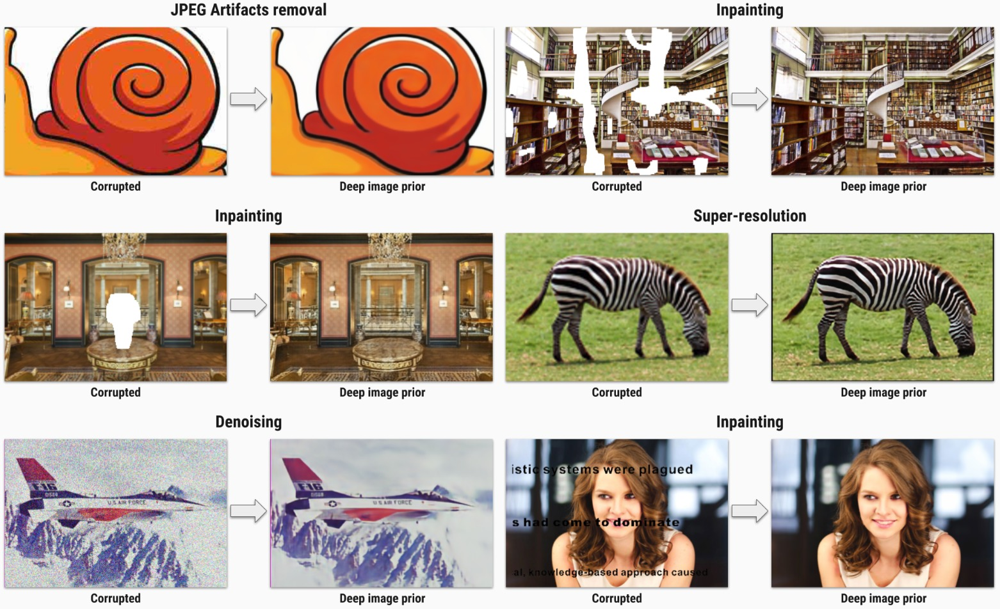

# Deep image prior

In this repository we provide *Jupyter Notebooks* to reproduce each figure from the paper:

> **Deep Image Prior**

Built a image generation algorithm using CNN and run it on standard inverse problems such as denoising, super-resolution, and inpainting.

Here we provide hyperparameters and architectures, that were used to generate the figures. Most of them are far from optimal. Do not hesitate to change them and see the effect.

# Install

Here is the list of libraries you need to install to execute the code:
- python = 3.6
- [pytorch](http://pytorch.org/) = 0.4
- numpy
- scipy
- matplotlib
- scikit-image
- jupyter

